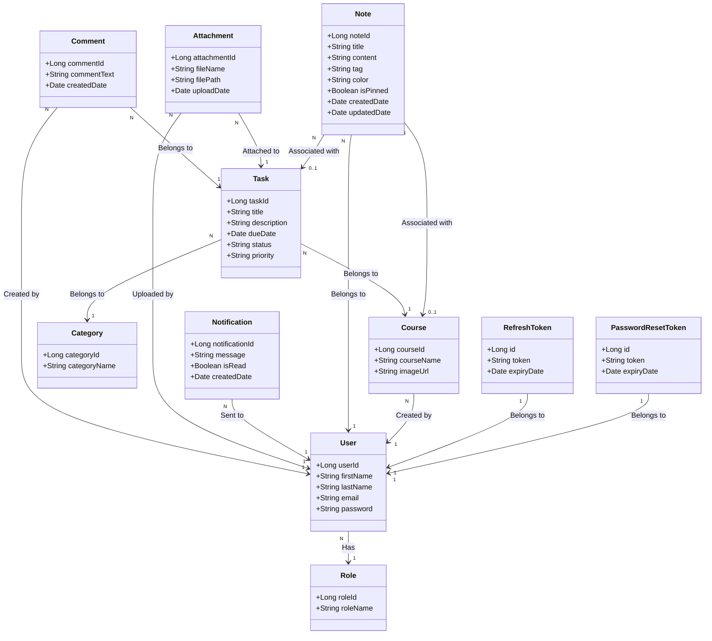
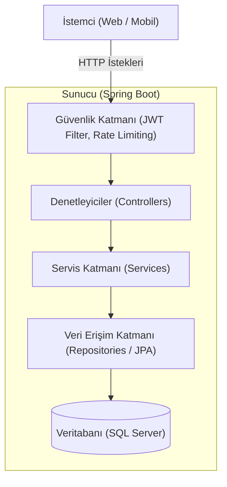
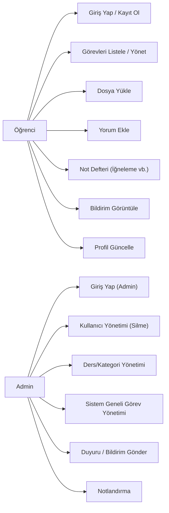

# Öğrenci Görev Takip Sistemi - UML Diyagramları

Bu doküman, Öğrenci Görev Takip Sistemi projesinin mimari yapısını, sınıflar arası ilişkilerini ve kullanım senaryolarını modelleyen UML diyagramlarını içermektedir. Diyagramlar Mermaid sözdizimi ile oluşturulmuştur.

---

## 1. Sınıf Diyagramı (Class Diagram)

Aşağıdaki diyagramda veri modelleri (entity sınıfları) ve aralarındaki veritabanı ilişkileri (ManyToOne, vb.) gösterilmektedir.

---

## 2. Bileşen Diyagramı (Component Diagram)

Sistemin katmanlı mimarisi ve güvenlik filtresi (JWT) ile olan iletişimini modelleyen bileşen diyagramı:

---

## 3. Kullanım Senaryosu (Use Case) Diyagramı

Sistemdeki aktörlerin (Öğrenci, Admin) kullanabildiği temel işlevleri gösterir.

